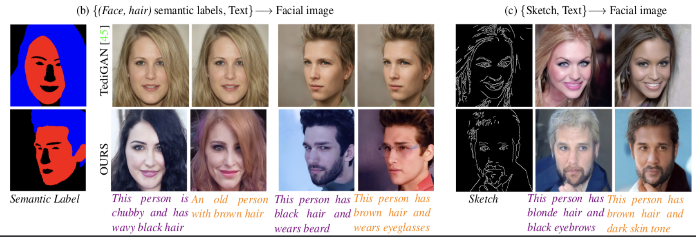
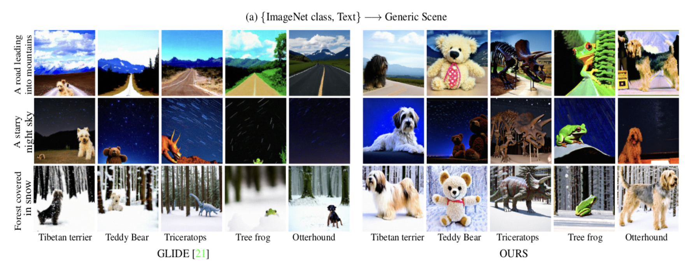
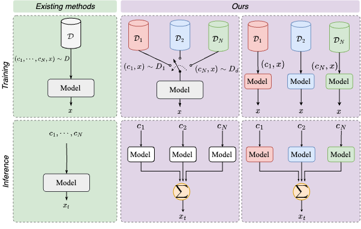

# Unite and Conquer (CVPR 2023)


This repository contains the implementation of the paper:
> **Unite and Conquer: Plug & Play Multi-Modal Synthesis using Diffusion Models**<br>
> [Nithin Gopalakrishnan Nair](https://nithin-gk.github.io/), [Chaminda Bandara](https://www.wgcban.com/), [Vishal M Patel](https://engineering.jhu.edu/vpatel36/vishal-patel/)

IEEE/CVF International Conference on Computer Vision (**CVPR**), 2023

From [VIU Lab](https://engineering.jhu.edu/vpatel36/), Johns Hopkins University

[[Paper](https://openaccess.thecvf.com/content/CVPR2023/papers/Nair_Unite_and_Conquer_Plug__Play_Multi-Modal_Synthesis_Using_Diffusion_CVPR_2023_paper.pdf)] |
[[Project Page](https://nithin-gk.github.io/projectpages/Multidiff)] |
[[Video](https://youtu.be/N4EOwnhNzIk)]

Keywords: Multimodal Generation, Semantic Face Generation, Multimodal Face generation, Text to image generation, Diffusion based Face Generation, Text to Image Generation, Text to Face Generation

## Applications




We propose **Unite and Conquer**, where users can use multiple modalities for face and generic image generation.
    *(a) Face Generation*. Given multi-modal controls, We can generate high-quality images consistent with the input conditions.
    *(b) Text and Class guided Genearation*. Users can input generic scenes and Imagenet classes to generate images with unlikely scenarios.

<br>


### Contributions:

- We propose a diffusion-based solution for image generation under the presence of multimodal priors.
- We tackle the problem of need for paired data for multimodal synthesis by deriving upon the flexible property of diffusion models.
- Unlike existing methods, our method is easily scalable and can be incorporated with off-the-shelf models to add additional constraints

<!-- <p align="center">
  
</p> -->

## Environment setup 


```
conda env create -f environment.yml
```


## Pretrained models:

Please download the pretrained models using
```
python download_models.py
```


# Testing On custom datasets 

## Data Preparation
You can test on any custom datasets by arranding the data in the following format. Please note that you can choose to give either one or more modalities
```
    ├── data 
    |   ├── face_map 
    |   └── hair_map  
    |   └── sketches
    |   └── text.txt

```
text.txt should be of the format
```
image_name : Text caption
```
An example would be:
```
0.jpg : This person wears eyeglasses
```

## Testing code
Test on custom data using:
```
python test_multimodal_face.py --data_path /path/to/data --face_map --hair_map --text
```

Please set the flags you need for the generation.
##  Instructions for Interactive Demo


##  Demo 


```
python gradio_set.py

```


Once you perform the above  steps, the models will automatically get downloaded to your Directory. One that is finished, the models will be automatically downloaded you will get a local demo link which can be used to tey the generation models on your own. More details about internal components of the code will be uploaded shortyl


## Citation
5. If you use our work, please use the following citation
```
@inproceedings{nair2023unite,
  title={Unite and Conquer: Plug \& Play Multi-Modal Synthesis Using Diffusion Models},
  author={Nair, Nithin Gopalakrishnan and Bandara, Wele Gedara Chaminda and Patel, Vishal M},
  booktitle={Proceedings of the IEEE/CVF Conference on Computer Vision and Pattern Recognition},
  pages={6070--6079},
  year={2023}
}
```

This code is reliant on:
```
https://github.com/openai/guided-diffusion
https://github.com/openai/glide-text2im
https://github.com/FacePerceiver/facer
```
